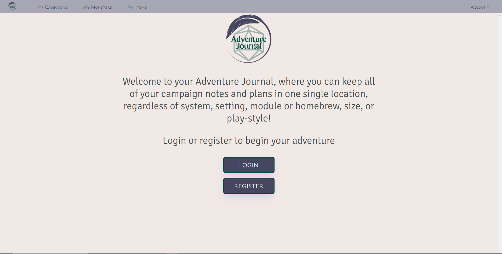
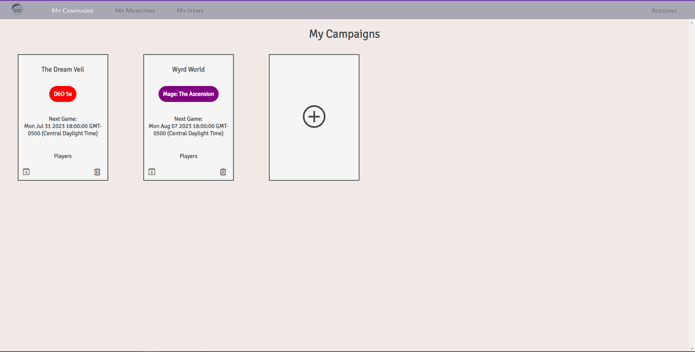
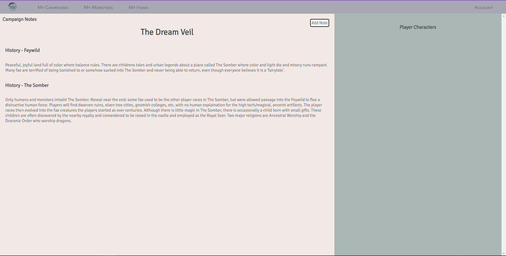
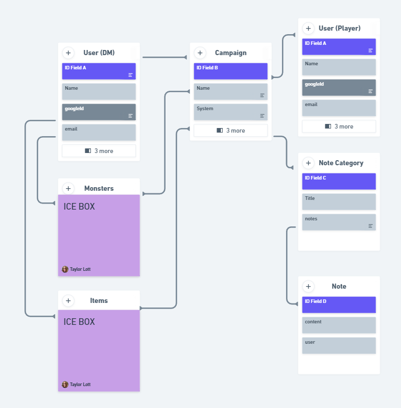
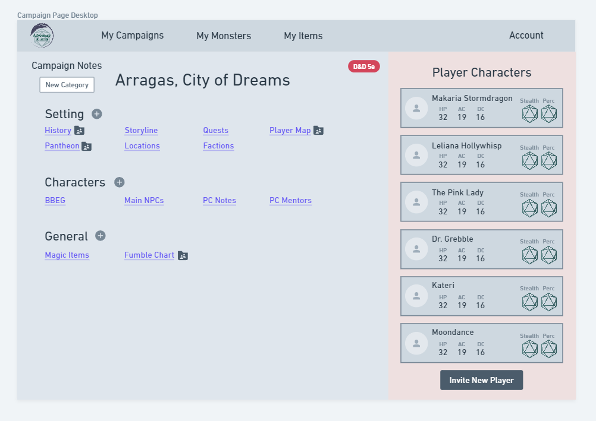
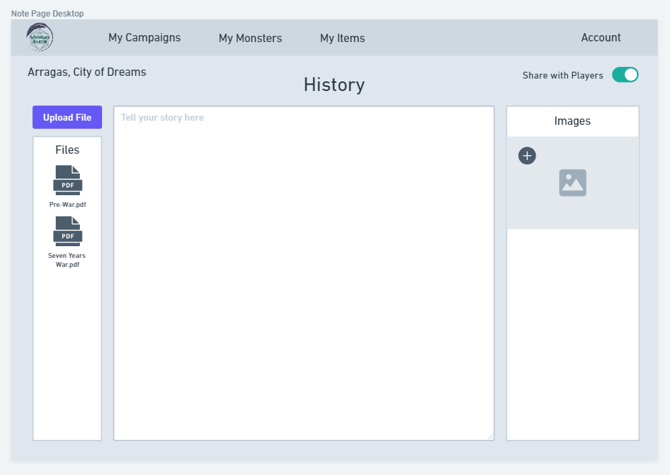

# Adventure Journal

  

Adventure Journal helps a Game Master keep all of their game notes in one, easy-to-access, location. In later updates, they will be able to invite players to their campaign. Those players will have access to creating a character for the game and any notes/resources that have been shared with the players by the GM. They will also have the ability to add notes which can either be private, shared with GM, and/or shared with all.

Our goal is to help GMs collaborate with their players regardless of system or virtual vs hybrid vs in person play, and with the ability to include custom/homebrew monsters, items, etc. The Game Master should be able to create without restriction to provide any experience they choose for their players!

## Screenshots
| Landing Page | My Campaigns | Campaign Notes |
| ------------ | ------------ | ------------ |
|   |   |		|

## Entity Relationship Diagram (ERD)

## Getting Started
You will login with a google account. From here, you will be able to create a campaign. You can add notes to your campaign by clicking on its title and clicking the 'Add Note' button. You can delete a campaign with the trash can in the bottom right of the campaign tile. 

More functionality is coming soon! Check out the Ice Box Features at the bottom of this file to see what you have to look forward to!

[Launch the app with Heroku](https://intense-hollows-35200-9cd88094a7e4.herokuapp.com/)

## Technology Used
HTML, CSS, Javascript, MongoDB, Mongoose, Express

## Ice Box Features
* Edit Campaign details
* Edit note information
* Categories for notes in each campaign
	* Sort by default (user designated), name, created by date
	* Sort notes within categories
	* Move notes between categories
* Notes contain a text area, document upload, and image upload section
	* Edit notes, share with all players or individuals
 	* Players can create notes and share with GM only, all players, or individuals
* GMs can invite players to join their campaign
	* Players get access to a charadter sheet, which populates data on campaign details page
 	* Players can roll dice from their character sheet
  * GM can make secret rolls with player information
  * Messaging to all or individuals
* GM can create monsters
	* API to use common creatures based on system
 	* Custom creatures can have special abilities
  * Duplicate existing creatures to quickly create similar creatures with unique changes
* GM can create and disseminate items
	* API to use common items based on system
 	* Custom items can have special abilities
  * Duplicate existing items to quickly create similar items with unique changes
  * Items can be added to a "loot crate" for players to recieve when GM releases it
* GM can create encounters by adding monsters and loot crates
	* Encounter screen allows GM to roll for monsters and provide a map if needed
 	* Possibly calculate running CR (Challenge Rating) to help GMs plan balanced encounters
 
## Ice Box Wireframes
| Campaign Details | Note Details | My Monsters | My Items | My Encounters |
| ------------ | ------------ | ------------ | ------------ | ------------ |
|   |   |	|	|	|
